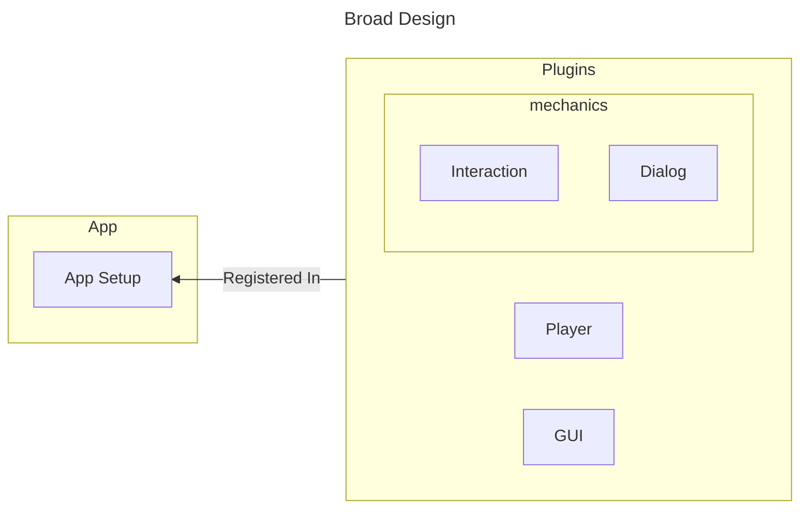
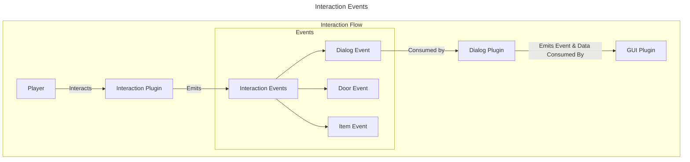

# Design Graphs

```mermaid
---
title: Broad Design
---
flowchart RL

subgraph Plugins
    direction LR
    Player
    GUI
    subgraph mechanics
        Interaction
        Dialog
    end
end

subgraph App
    direction LR
    EntryPoint[App Setup]
end
Plugins --> |Registered In| EntryPoint
```

```mermaid
---
title: Interaction Events
---
flowchart TD

subgraph Interaction Flow
    P[Player]
    %% Need to rewrite code on keeping interaction control only to player
    %% Should not be controlled by other systems to keep interactions contained
    %% In One place
    Int[Interaction Plugin]
    DP[Dialog Plugin]
    GUI[GUI Plugin]
    subgraph Events
        IE[Interaction Events]
        DE[Dialog Event]
        DoE[Door Event]
        ItE[Item Event]
    end
end

P --> |Interacts| Int 
Int --> |Emits| IE

IE --> DE
IE --> DoE
IE --> ItE

DE --> |Consumed by| DP

DP --> |Emits Event & Data Consumed By| GUI
```